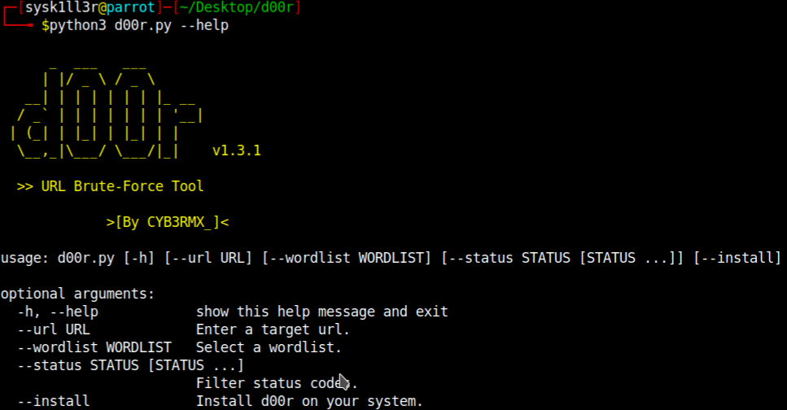

# d00r
  
<br>Simple directory brute-force tool written with python.<br>

- [X] Usage before install: ```python3 d00r.py --url [url] --wordlist [wordlist_file] --status 2xx 3xx --thread 100```
- [X] Usage after install: ```d00r --url [url] --wordlist [wordlist_file] --status 2xx 3xx --thread 100```

# Screenshot


# Setup
<b>Necessary python modules</b>: ```tqdm```, ```prettytable``` and ```argparse```<br>
<b>Installation of python modules</b>: ```pip3 install -r requirements.txt```<br>

# Arguments  
- --url: Specify target url. Example => http://192.168.1.1
- --wordlist: Select wordlist file. Example => /usr/share/wordlists/dirb/common.txt
- --status: Filter status codes. Example => 200 301 403
- --thread: Number of threads. Example => 100
- --install: Install d00r on your system.

# Updates
- [X] 06/09/2020: Added thread support.
